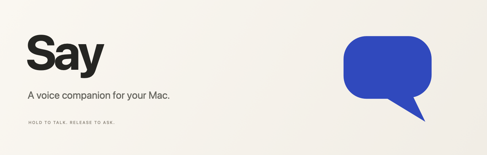

<p align="center">
  
</p>

<p align="center">
  macOS 14+ &nbsp; · &nbsp; Native Swift &nbsp; · &nbsp; Bring your own API keys
</p>

Say lives in your menu bar. Hold <kbd>Control</kbd> + <kbd>Option</kbd> + <kbd>Space</kbd>, speak, and release.

Ask it to open Calculator, type into a document, explain your screen, or look something up with sources. Choose Dictate to put your words into the app you are using. Press <kbd>Escape</kbd> to cancel.

## Get started

Open the DMG and drag Say into Applications. Eject the disk image, then open Say from Applications. To make a DMG from this source, use the build command below.

1. Click the Say speech bubble in your menu bar and choose Settings from the three-dot menu, or press Command-comma.
2. In Connections, paste a [TypeSafe](https://typesafe.ai/) key for Jev and an OpenAI key with access to `gpt-live-transcribe`, pressing Return after each.
3. Allow Microphone access when you first speak, and enable Accessibility so Say can operate your apps.

Try saying “Open Calculator.” You can also click the microphone to record, then click Finish recording.

Keys stay in macOS Keychain. Screen Recording permission is optional, for reading text in apps that expose few controls. This local build is not Apple-notarized. If macOS blocks it, use System Settings → Privacy & Security → Open Anyway.

## What leaves your Mac

While you record, audio streams to OpenAI for transcription. Jev chooses Mac actions, and OpenAI handles conversation, web research, and drafts. Both services require internet access and bill your API usage.

On-screen text goes to those services when needed for your request. Screenshots stay on your Mac, and Say does not save audio. Conversation history is off by default.

Say asks before sensitive actions such as sending or deleting. Cancellation stops further work, but cannot undo completed actions or recall audio already sent. App control depends on the controls that macOS exposes.

## Build it

Install Xcode 15.3 or newer and Python 3.10+, then run this from the repository root:

```sh
cd say
bash run.sh --dmg
```

The installer appears in `build/`. The script installs pinned DMG tools into `.build/dmg-tools` on the first run. Run `bash run.sh` to build and launch, or `bash run.sh --build-only` for just the app. There are no third-party Swift dependencies.

```sh
swift test
swift format lint --strict --recursive Sources Tests Resources/GenerateIcon.swift Package.swift
```

See [testing](TESTING.md) for live checks and permission setup, or [design notes](docs/RESEARCH.md) for the original references.
